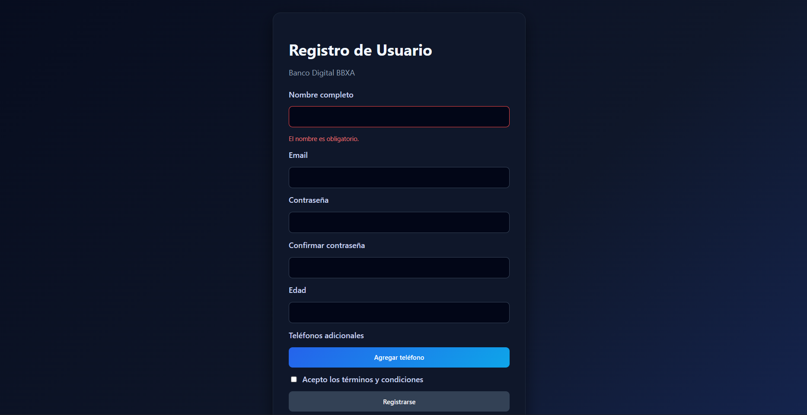
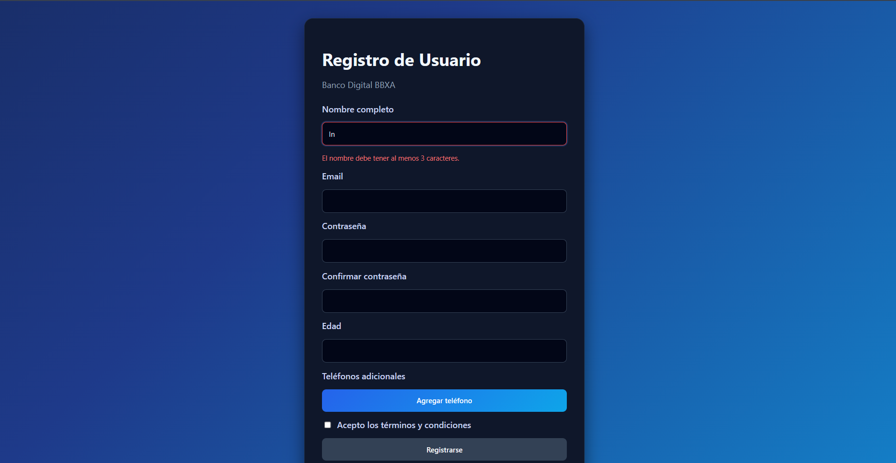
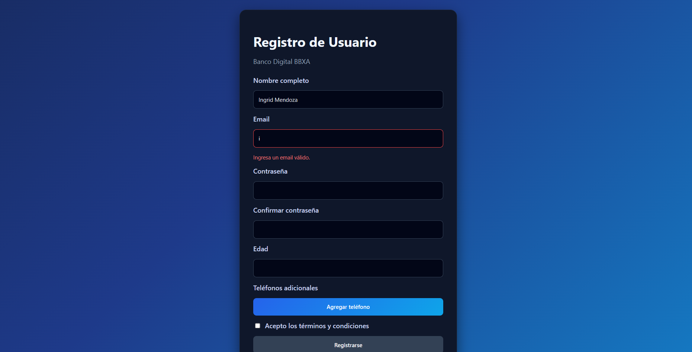
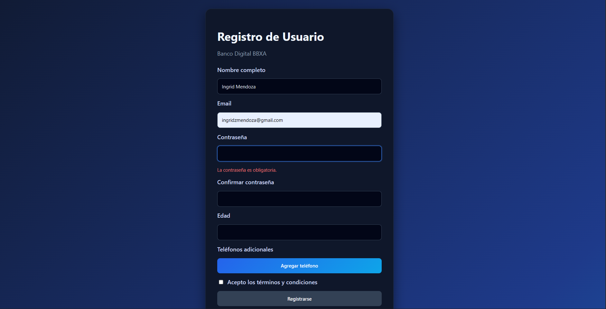
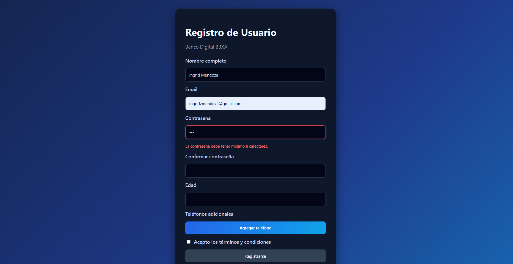
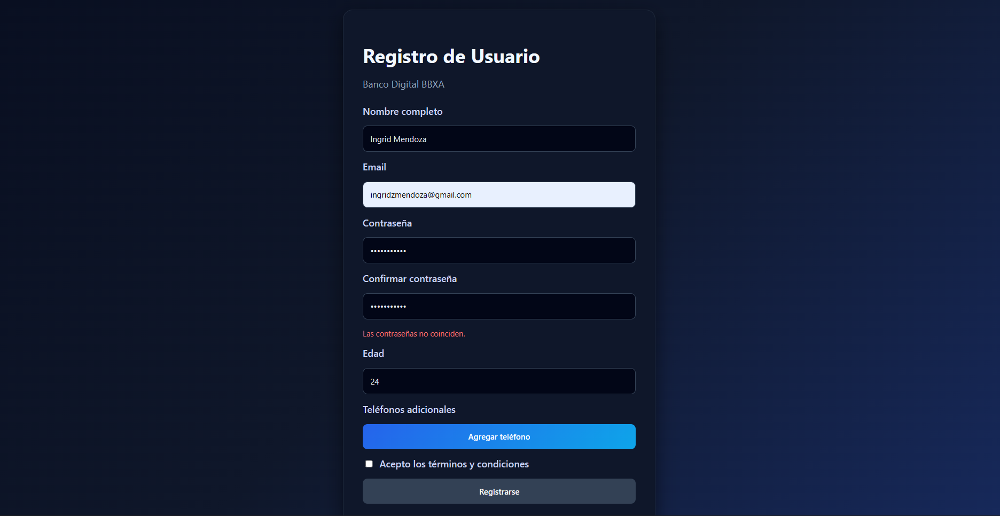
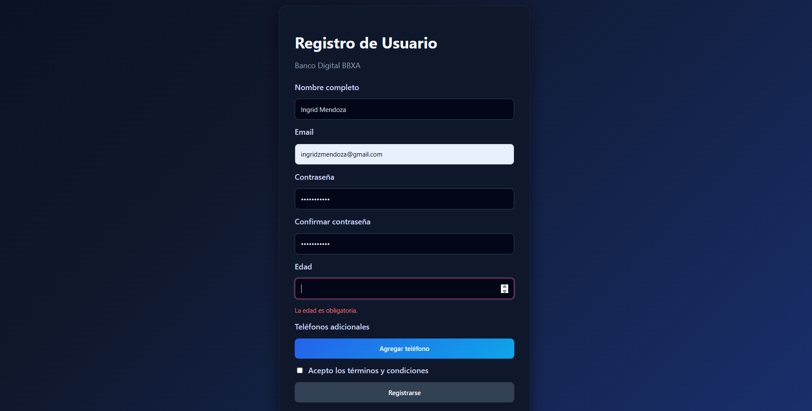
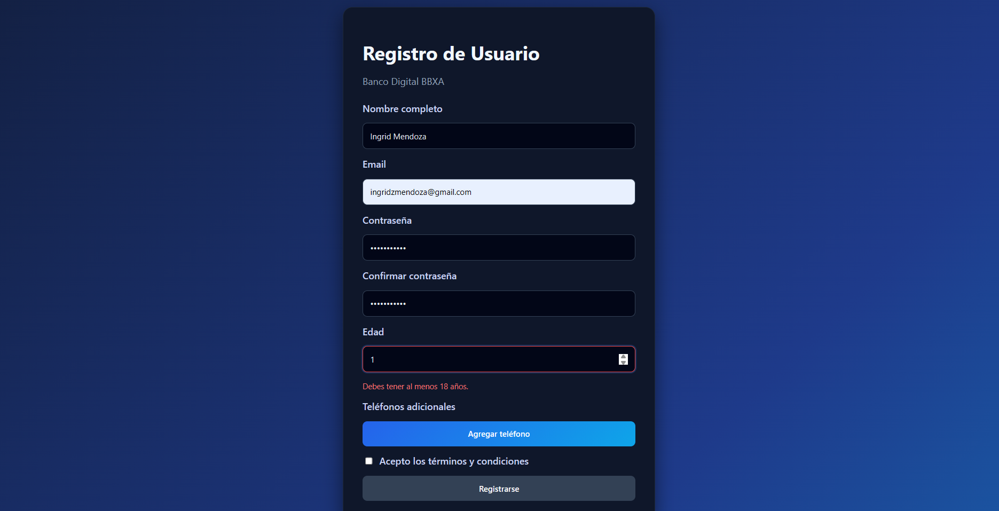
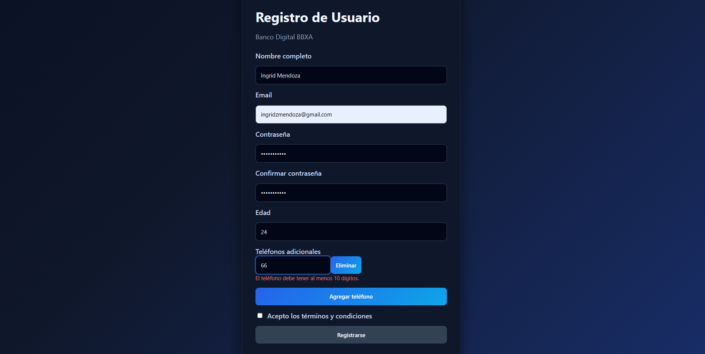
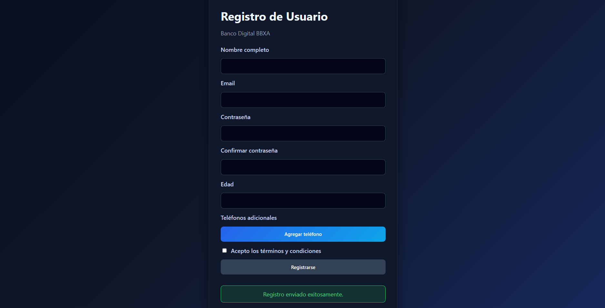

# Formulario de Registro de Usuario - Angular

## Descripción

Este proyecto consiste en la creación de un **formulario de registro de usuarios** para un banco digital utilizando **Angular** y **Reactive Forms**.
El formulario valida los datos en tiempo real, muestra mensajes de error amigables y evita el envío de información inválida.

El objetivo principal es practicar el uso de formularios avanzados en Angular aplicando validaciones síncronas y asíncronas.

---

## Tecnologías utilizadas

* Angular
* TypeScript
* HTML
* CSS
* Reactive Forms

---

## Funcionalidades

El formulario incluye:

* Validación en tiempo real
* Confirmación de contraseña
* Validación de edad mínima
* Validación asíncrona de email (simulación)
* Mensajes de error específicos por campo
* Deshabilitar el botón de envío si el formulario es inválido
* Reset del formulario después de un envío exitoso
* Simulación de envío a una API usando `setTimeout`
* Manejo dinámico de teléfonos adicionales usando `FormArray`

---

## Campos del formulario

* Nombre completo
* Email
* Contraseña
* Confirmar contraseña
* Edad
* Teléfonos adicionales
* Aceptación de términos y condiciones

---

## Conceptos aplicados

Este proyecto utiliza los siguientes conceptos de Angular:

* `FormGroup`
* `FormControl`
* `FormArray`
* Validadores personalizados
* Validaciones asíncronas
* Uso de `touched` y `dirty`
* Reactive Forms
* Manejo de estados del formulario

---

## Estructura del proyecto

```
src/
│
├── app/
│   ├── app.ts
│   ├── app.html
│   ├── app.css
│   ├── app.config.ts
│   └── app.routes.ts
│
├── styles.css
├── index.html
└── main.ts
```

---

## Cómo ejecutar el proyecto

1. Instalar dependencias:

```
npm install
```

2. Ejecutar el servidor de desarrollo:

```
ng serve
```

3. Abrir en el navegador:

```
http://localhost:4200
```

---

## Evidencia

### Validación de nombre




### Validación de correo



### Validación de contraseña





### Validación de edad




### Validación de teléfonos



### Validación de registro





